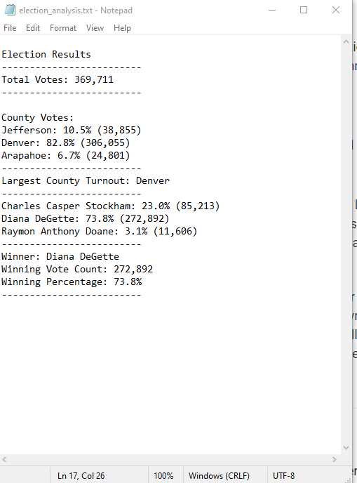

# Module_3_Election_Analysis_Challenge

## **Overview of Election Audit**: The purpose of this analysis was to enable the election to commission to calculate the voter turnout and percentage of votes at the Colorado county level.

### In the Bootcamptspot Module lesson, we had originally created an analysis that summarized the CO election results by candidate, but the election commission asked us to go a level deeper and perform a similar analysis at the county level. Specifically, they wanted to understand how many voters each county saw, but they wanted to understand which county saw the most voters in this election.

## **Election Audit Results**:

- There were **369,711** votes cast in this congressional election

- Number of votes and the percentage of total votes for each county in the precinct were as follows:
  - Jefferson: 10.5% (38,855)
  - Denver: 82.8% (306,055)
  - Arapahoe: 6.7% (24,801)
  
- Denver county had the largest number of votes with **306,055** of them
  
- Number of votes and the percentage of the total votes each candidate received were as follows:
  - Charles Casper Stockham: 23.0% (85,213)
  - Diana DeGette: 73.8% (272,892)
  - Raymon Anthony Doane: 3.1% (11,606)

- Diana DeGette won the election with **272,892** votes, representing **73.8%** of the total votes

## **Election-Audit Summary**:

While we used our script to run an analysis of the outcome of a "small" election based on *popular* votes (i.e. the candidate with the highest percentage of the total votes wins), with only three candidates in three different counties, we could modify the script to be used for a presidential election based on electoral college votes. 

1. If we wanted to use this script to define the winner of an *electoral college-based* election, we would need to replace our votes by county calculation to total votes by states.
Furthermore, we would need to define the number of electoral colleges by state, and add those as a variable to our script.
Lastly, we would need to calculate the number of electoral college votes won by candidate and by state, and based on those, we would be able to define the winner of the presidental race.

2. One additional way to use this script for another type of election would be if an election were in 2 rounds, just like in France. In the 1st round, voters can vote for any of the candidates that run for election. The script we built for the CO Board of Elections would be applicable in this case, as it would calculate the percentage of votes for **all** candidates. From that, we could modify the script to select the top 2 winners, as opposed to the winner with the highest score. In the 2nd round, voters could only vote for one of the top 2 candidates. Again, our initial vote would be applicable as the winner of this type of election would be the candidate with the highest number of votes. 

